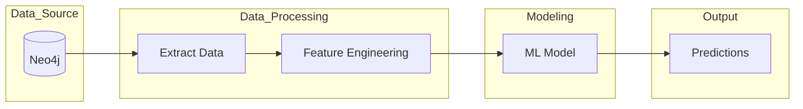
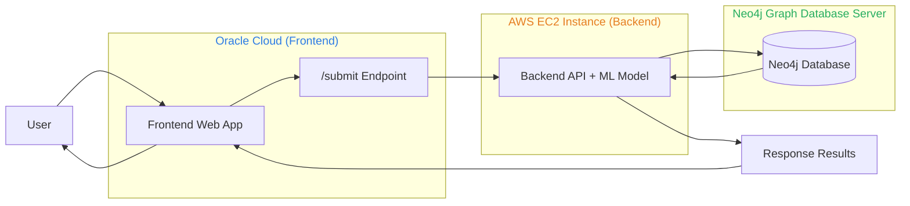

# BitGuard

## Teammates
-
-
-
-

### Instance type
- r7i.8xlarge (main)

## Architecture

### Data Pipeline

### System Architecture

## Base EC2 storage location for neo4j
/data/neo4j

# Credits and Acknowledgements
Full acknowledgements of this project to EBA and the neo4j ddatabase restoration.
- https://eba.b1aab.ai/
- https://eba.b1aab.ai/docs/bitcoin/etl/restore/ 
