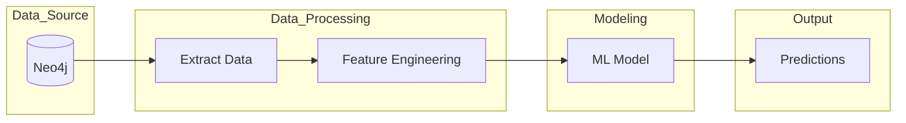

# BitGuard

BitGuard is a Bitcoin wallet address risk assessment tool designed to help users evaluate whether a wallet may be safe, suspicious, or potentially linked to illicit activity. By combining blockchain-derived features with machine learning, BitGuard aims to turn complex transaction behavior into a simple, understandable risk score.

## Team
Graduate Students from UC Berkeley

- Chirag Agarwal
- Noah Cederholm
- Steven Au
- Wes Morberg

## Project Overview

Sending Bitcoin to the wrong wallet can be costly and irreversible. Many users, especially those with limited blockchain experience, have no easy way to judge whether a wallet address is trustworthy before sending funds.

BitGuard addresses this problem by analyzing wallet behavior and producing a risk assessment score that can help users make safer decisions. The goal is to provide a simple interface backed by a more advanced modeling pipeline, so users do not need to understand raw blockchain data in order to benefit from it.

## Target Users

BitGuard is intended for:

- First-time or occasional Bitcoin users
- Less technical users who want a simple confidence check before sending funds
- Users copying wallet addresses from unfamiliar sources
- Wallet providers or exchanges interested in lightweight wallet risk scoring

## Core Features

- Wallet address risk assessment
- Easy-to-understand output for end users
- Machine learning-based scoring using blockchain-derived features
- Backend integration with Neo4j graph data
- Cached request/response flow for improved performance
- Web-based frontend for submitting wallet addresses

## Architecture

### Data Pipeline

The BitGuard modeling workflow begins with Bitcoin-related graph data stored in Neo4j. Data is extracted and transformed into model-ready features, which are then passed into a machine learning model to generate predictions.

### System Architecture

The system is structured as a web application with a frontend, backend API, cache layer, and graph database. The frontend accepts user input, the backend handles scoring requests, and Neo4j supports the underlying blockchain data queries.

```mermaid
flowchart LR

U[User]

subgraph Oracle["<span style='color:#2c7be5'>Oracle VM</span>"]
    direction TB

    subgraph OracleFrontend["<span style='color:#17a2b8'>Oracle Frontend</span>"]
        FE[Frontend Web App]
    end

    subgraph OracleBackend["<span style='color:#3b5bdb'>Oracle Backend</span>"]
        SUBMIT["/submit Endpoint"]
        CACHE[(Redis Cache)]
    end
end
style Oracle fill:#2b2b2b,stroke:#4a4a4a

subgraph Backend["<span style='color:#c0392b'>Backend API</span>"]
    direction TB

    subgraph AWS["<span style='color:#e67e22'>Amazon VM</span>"]
        direction LR
        VALIDATE["/validate Endpoint"]
        MODEL[ML Model]
        APIRESP[API Response]
    end

    subgraph Graph["<span style='color:#27ae60'>Neo4j Graph Database</span>"]
        DB[(Neo4j Database)]
    end
end
style Backend fill:#2b2b2b,stroke:#4a4a4a

U --> FE
FE -- POST request --> SUBMIT
SUBMIT --> CACHE
CACHE -- POST request --> VALIDATE
VALIDATE -- POST request --> DB
DB -- data --> MODEL
DB -- Not found or Error --> APIRESP
MODEL -- prediction --> APIRESP
APIRESP --> CACHE
CACHE --> FE
FE --> U
```

## How BitGuard Works

At a high level, BitGuard follows this process:

1. A user enters a Bitcoin wallet address into the web interface.
2. The frontend sends the request to the backend through the submit endpoint.
3. The backend checks the cache for an existing result.
4. If needed, the backend queries Neo4j and or model-ready data sources.
5. Features associated with the wallet are passed into the machine learning model.
6. The model returns a risk prediction or score.
7. The result is sent back to the user through the frontend.

This flow is intended to make sophisticated blockchain analysis easier to use for non-technical users.

## Using the Website

### Basic Usage

1. Open the BitGuard web application in your browser.
2. Enter a Bitcoin wallet address into the search or input field.
3. Submit the address for analysis.
4. Review the returned risk assessment and any supporting output shown in the interface.

### Example User Workflow

A user receives a Bitcoin wallet address for payment, investment, or transfer. Before sending funds, they can paste the address into BitGuard to get a quick risk check. The goal is to provide an additional layer of confidence before taking an irreversible action.

## Repository Structure

A typical high-level structure for this project includes:

- `frontend/` - web interface and static assets
- `backend/` - API and model-serving logic
- `README.md` - project documentation

You can update this section to match the exact structure of your repository if needed.

## Model and Data Notes

BitGuard relies on blockchain-related data and derived wallet features to support its predictions. These features may include transaction behavior, graph-based signals, and other indicators associated with wallet activity.

The exact modeling approach, feature set, and evaluation strategy may continue to evolve as the project develops.

## Future Improvements

Potential future directions for BitGuard include:

- expanding wallet coverage and labeling
- improving model interpretability
- providing more detailed explanations for flagged wallets
- adding confidence intervals or explanation layers to model outputs
- strengthening evaluation against known risky wallet categories
- improving frontend UX for non-technical users

## Limitations

BitGuard is intended as a decision-support tool, not a guarantee of wallet safety. A low-risk score does not prove that a wallet is safe, and a high-risk score should be interpreted as a warning signal rather than definitive proof of wrongdoing.

Users should treat BitGuard as one input into a broader decision-making process.

## Credits and Acknowledgements

This project builds on external resources and infrastructure related to Bitcoin graph data and Neo4j restoration workflows.

Special acknowledgement to:

- EBA
- Neo4j database restoration documentation

Resources:

- https://eba.b1aab.ai/
- https://eba.b1aab.ai/docs/bitcoin/etl/restore/

## Disclaimer

BitGuard is an academic/capstone project and should not be treated as a production-grade compliance, fraud prevention, or forensic platform. Its outputs are intended for research, demonstration, and educational purposes.
